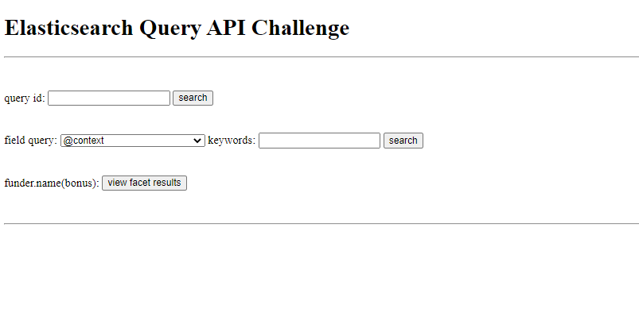
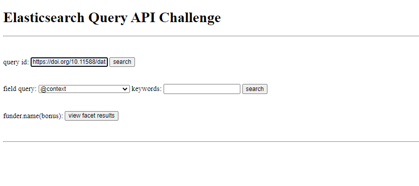
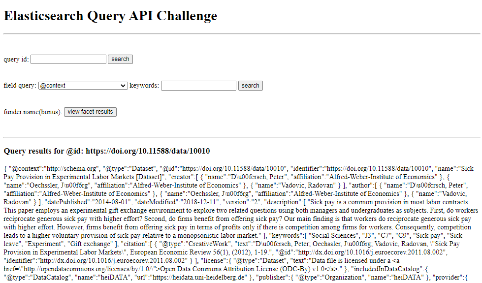
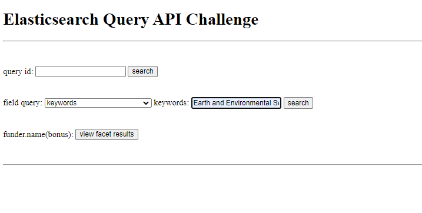
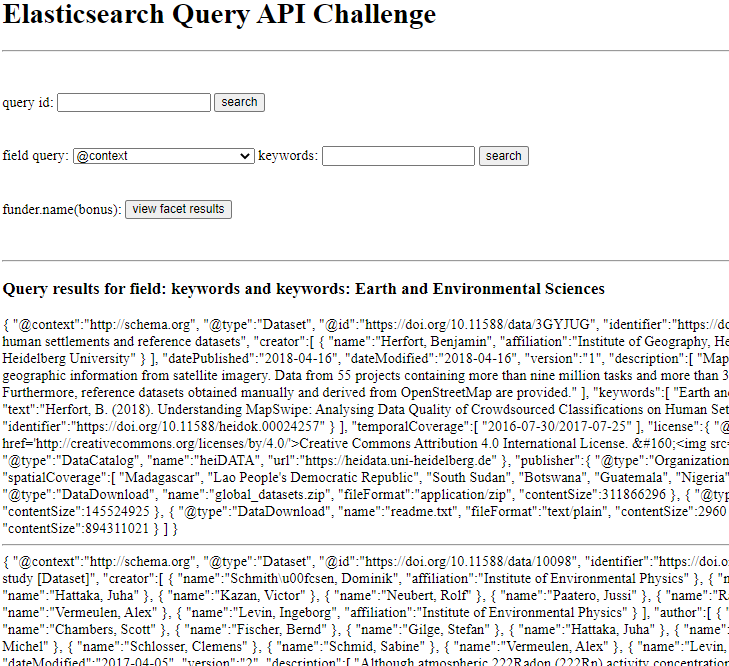
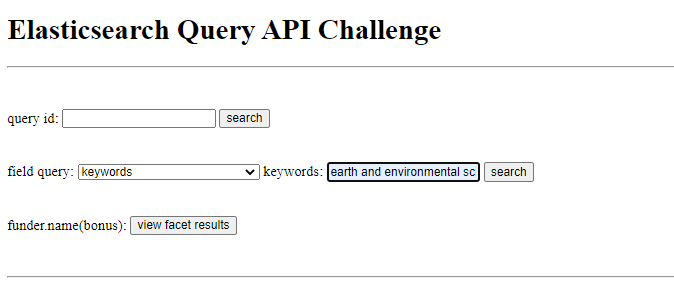
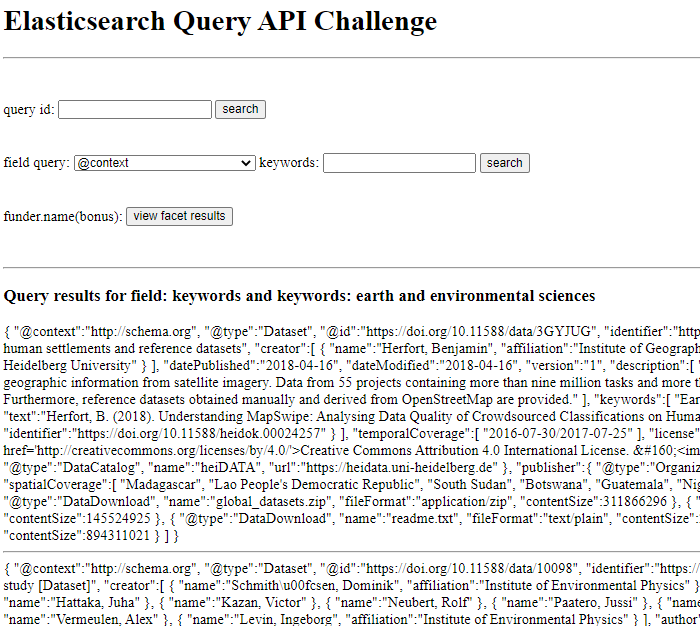
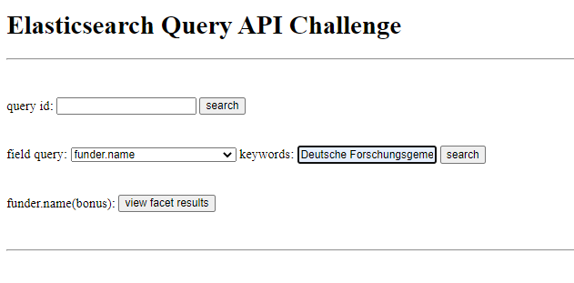
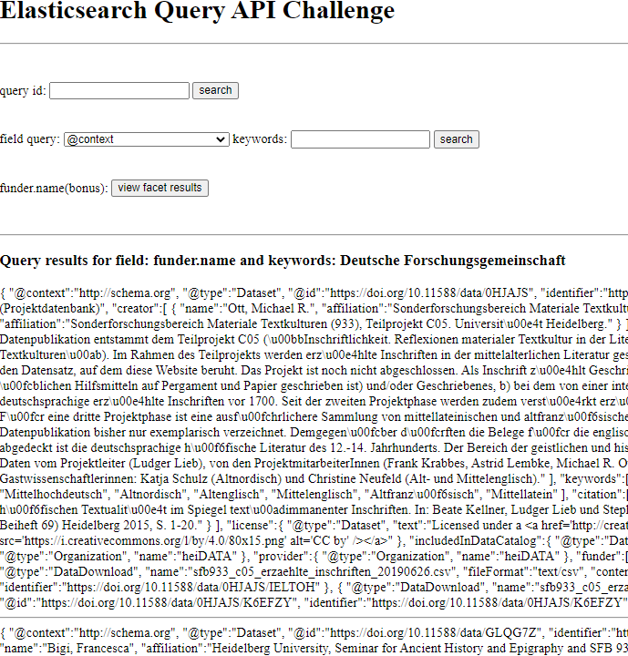
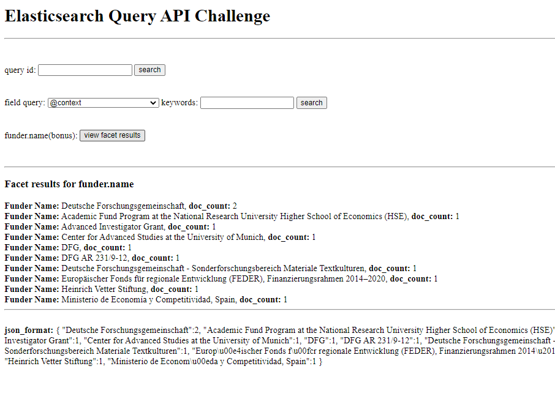

# Simple Elasticsearch API  

## Instructions  
This assumes you have Python 3, have the Elasticsearch 7 server installed and the Python Flask and Elasticsearch packages installed. Installation instructions are listed below.

### Installation:  
> Install [Elasticsearch server](https://www.elastic.co/guide/en/elasticsearch/reference/current/install-elasticsearch.html)     

> Install Flask [docs](https://flask.palletsprojects.com/en/2.0.x/installation/)  

`> pip install Flask`  

> Install Elasticsearch Python Package [docs](https://elasticsearch-py.readthedocs.io/en/v7.13.4/)  

`> python -m pip install elasticsearch`

### Setup and Run App  

1. Start elasticsearch server  
In your terminal change directory to where you have downloaded the elasticsearch server and start the server.  
For windows:  
       `cd C:\elasticsearch-7.13.4\elasticsearch-7.13.4`       
       `.\bin\elasticsearch.bat`       
On mac:  
        `cd /apps/elasticsearch/elasticsearch-2.3.1`    
        `elasticsearch`  

2. Load and index the data into Elasticsearch  
Run the script `create_index.py` in the `load_and_index/` folder to automatically load and index the harvard metadata dateset into ES. *Note: must run in `load_and_index/` folder to grab file, did not add absolute path search.*  
        `cd load_and_index`      
        `python create_index.py`     

3. Run local flask app   
App is located in the `elasticsearch/` folder. Run the following commands then go to `http://localhost:8000/` to view the API.  
        `cd elasticsearch`       
        `python app.py`          

### Notes/Assumptions:  
* this is a **very simple** web api [no models, only one route, etc]
* run it locally, did not deploy
* for the output data I removed the elasticsearch tags, such as the "_shards", "hits", etc.  
* in the `load_and_index/` folder I have placed `.json` files that show the mappings and the settings for elasticsearch, and the `Index_Data.ipynb` and the `Index_bonus.ipynb` were notebooks used to test the indexing process

### Examples  

#### Starting View      

#### Search by ID  
 
<h5> <u>Input ID</u> </h5>  

  
<h5><u>Results</u></h5>   
 

  

 

#### Search by fields  

<h5><u>Search keyword field</u></h5>

    

<h5><u>Results</u></h5>   
 

  
  

<h5><u>Search keyword field (lowercase)</u></h5>
 

    
 

<h5><u>Results (same as above)</u></h5>   
   

   

<h5><u>Search funder.name field</u></h5>

  

<h5><u>Results</u></h5>   
 

#### Facet for funder.name
   

